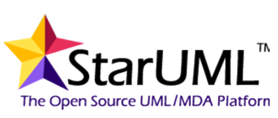

<h3 align="center">BAB II 
LANDASAN TEORI</h3>
 
<b>2.1	Pengertian Sistem Perancangan</b>

Pada saat hendak membuat sebuah sistem yang akan digunakan pada suatu perusahaan, setiap pengembang aplikasi diharuskan membuat sebuah rancangan dari sistem yang ingin dibuat. Rancangan ini bertujuan untuk memberi gambaran umum dari sistem yang akan berjalan nantinya kepada setiap stakeholder. Menurut Satzinger, Jackson, dan Burd (2012:5), perancangan sistem adalah sekumpulan aktivitas yang menggambarkan secara rinci bagaimana sistem akan berjalan. Hal itu bertujuan untuk menghasilkan produk perangkat lunak yang sesuai dengan kebutuhan user[1].

<b>2.2	Pengertian Pengelolaan Data</b>

Pengelolaan adalah proses, cara, perbuatan mengelola, proses melakukan kegiatan tertentu dengan menggerakan tenaga orang lain; proses yang membantu merumuskan kebijakan dan tujuan organisasi; proses yang memberikan pengawasan pada semua hal yang terlibat dalam pelaksanaan dan pencapaian tujuan”[2].Sedangkan menurut Haer Talib, data adalah sekumpulan fakta dan sebuah fakta tak lain adalah sebuah kenyataan atau kejadian [3].

<b>2.3. Pengertian Pendistribusian Data</b>

Pendistribusian data merupakan penyampaian data atau informasi yang telah diolah kepada pihak yang membutuhkan infomasi agar dapat digunakan untuk mencapai tujuan yang diinginkan[4].

<b>2.4	Pengertian Proposal</b>

Proposal adalah usulan rencana kegiatan. Kata proposal berasal dari bahasa Inggris to propose yang artinya mengajukan. Dengan demikian pengertian proposal memiliki arti sederhana sebagai suatu bentuk pengajuan atau permohonan, penawaran baik berupa ide, gagasan, pemikiran, maupun rencana kepada pihak lain untuk mendapatkan dukungan ijin, persetujuan, dana, dan lain sebagainya. Sebagai bentuk pengajuan, proposal bernilai penting dan strategis karena merupakan awal yang menentukan keberhasilan suatu rencana program (usaha atau kegiatan). Karenanya, banyak orang atau lembaga menjadikan proposal sebagai "senjata ampuh" untuk menunjukkan apa saja ide, rencana kegiatan (usaha), dan program yang ditawarkan kepada pihak-pihak yang berkepentingan [5].

<b>
2.5	Pengertian Karya Ilmiah</b>

Karya Ilmiah adalah Suatu karangan atau tulisan yang diperoleh sesuai dengan sifat keilmuannya dan didasari oleh hasil pengamatan, peninjauan, penelitian dalam bidang tertentu, disusun menurut metode tertentu dengan sistematika penulisan yang bersantun bahasa dan isinya dapat dipertanggungjawabkan kebenarannya/keilmiahannya[6].

<b>
2.6	UML 
2.6.1	Pengertian UML</b>

Menurut Nugroho (2010:6), UML (Unified Modeling Language) adalah ‘bahasa’ pemodelan untuk sistem atau perangkat lunak yang berparadigma ‘berorientasi objek”. Pemodelan (modeling) sesungguhnya digunakan untuk penyederhanaan permasalahan-permasalahan yang kompleks sedemikian rupa sehingga lebih mudah dipelajari dan dipahami.

<b>
2.6.2	Model UML (Unified Modeling Language)</b>

Menurut Widodo (2011:10), “Beberapa literature menyebutkan bahwa UML menyediakan sembilan jenis diagram, yang lain menyebutkan delapan karena ada beberapa diagram yang digabung, misanya diagram komunikasi, diagram urutan dan diagram pewaktuan digabung menjadi diagram interaksi”. Namun demikian model-model itu dapat dikelompokkan berdasarkan sifatnya yaitu statis atau dinamis. Jenis diagram itu antara lain:
a.	Diagram kelas (Class Diagram) 
Bersifat statis, Diagram ini memperlihatkan himpunan kelas-kelas, antarmuka-antarmuka, kolaborasi-kolaborasi, serta relasi-relasi. Diagram ini umum dijumpai pada pemodelan sistem berorientasi objek. Meskipun bersifat statis, sering pula diagram kelas memuat kelas-kelas aktif. 
b.	Diagram paket (Package Diagram) 
Bersifat statis. Diagram ini memperlihatkan kumpulan kelas-kelas, merupakan bagian dari diagram komponen. 
c.	Diagram use-case (Usecase Diagram) 
Bersifat statis. Diagram ini memperlihatkan himpunan use-case dan aktor-aktor (suatu jenis khusus dari kelas). Diagram ini terutama sangat penting untuk mengorganisasi dan memodelkan perilaku suatu sistem yang dibutuhkan serta diharapkan pengguna. 
d.	 Diagram interaksi dan sequence (Sequence Diagram) 
Bersifat dinamis. Diagram urutan adalah iterasiksi yang menekankan pada pengiriman pesan dalam suatu waktu tertentu. 
e.	 Diagram komunikasi (Communication Diagram)	 
Bersifat dinamis. Diagram sebagai pengganti diagram kolaborasi UML yang menekankan organisasi struktural dari objek - objek yang menerima serta mengirim pesan. 
f.	Diagram statechart (Statechart Diagram) 
Bersifat dinamis. Diagram status memperlihatkan keadaan-keadaan pada sistem, memuat status (state), transisi, kejadian serta aktivitas. 
g.	Diagram aktivitas (Activity Diagram) 
Bersifat dinamis. Diagram aktivitas adalah tipe khusus dari diagram status yang memperlihatkan aliran dari suatu suatu aktivitas ke aktivitas lainnya dalam suatu sistem. Diagram ini terutama penting dalam pemodelan fungsi-fungsi suatu sistem dan memberi tekanan pada aliran kendali antar objek. 
h.	Diagram komponen (Component Diagram) 
Bersifat statis. Diagram komponen ini memperlihatkan organisasi serta kebergantungan sistem/perangkat lunak pada komponen-komponen yang telah ada sebelumnya. 
i.	Diagram deployment (deployment diagram) 
Bersifat statis. Diagram inimemperlihatkan konfigurasi saat aplikasi dijalankan (run-time). Memuat simpul-simpul beserta komponen-komponen yang di dalamnya. Kesembilan diagram ini tidak mutlak harus digunakan dalam pengembangan perangkat lunak, semuanya dibuat sesuai kebutuhan. Pada UML dimungkinkan kita menggunakan diagram-diagram lainnya misalnya data flow diagram, entity relationship diagram, dan sebagainya.

<b>2.7	Framework CodeIgniter</b>

Menurut Basuki (2010) bahwa Codeigniter adalah sebuah framework PHP yang dapat membantu mempercepat developer dalam pengembangan aplikasi website berbasis PHP dibandingkan jika menulis semua kode program dari awal. Codeigniter menyediakan banyak library untuk mengerjakan tugas-tugas yang umumnya ada pada sebuah aplikasi berbasis web. Selain itu, struktur dan susunan logis dari Codeigniter membuat aplikasi yang dibuat menjadi semakin teratur dan rapi. Dengan demikian developer dapat fokus pada fitur-fitur apa yang dibutuhkan oleh aplikasi dengan membuat kode program seminimal mungkin. Codeigniter pertama kali dibuat oleh Rick Ellis, CEO Ellislab, Inc. (http://ellislab.com), sebuah perusahaan yang memproduksi sebuah CMS (Content Management System) yang cukup handal, yaitu ExpressionEngine (http://www.expressionengine.com). Saat ini, Codeigniter dikembangkan dan dimaintain oleh ExpressionEngine Development Team.

<b>2.8	CSS Bootstrap</b>

Ditarik kesimpulan dari Neter John et al (1996:429), Bootsrap merupakan framework yang digunakan untuk membangun sebuah desain web secara responsive. Artinya, desain web yang dirancang menggunakan bootstrap akan menyesuaikan dengan ukuran layar dari browser yang digunakan baik desktop, tablet ataupun mobile device. Dengan bootstrap pengguna dapat membangun sebuah web yang dinamis ataupun statis.

<b>
2.9	jQuery</b>

Menurut Kadir (2013a:10) “Jquery adalah pustaka yang dibangun dengan menggunakan JavaScript. jQuery dibuat oleh John Resign pada tahun 2006. Banyak website yang memanfaatkan library ini untuk menyederhanakan fungsi-fungsi yang ada di javascript atau ajax.
Sesuai dengan slogannya menurut Kadir (2012b:10) “jQuery sendiri “Write Less, Do More”, menulis sedikit namun mengerjakan banyak hal, sehingga anda dapat menghemat coding program, yang sebelumnya menggunakan javascript beberapa baris kode, namun jQuery hanya satu baris saja”.

<b>
2.10	Software yang digunakan 
2.10.1	Sublime Text 3</b>

 

Gambar 2.1 Sublime Text 3

Sublime Text adalah teks editor berbasis Python, sebuah teks editor yang elegan, kaya akan fitur, cross-platform, mudah dan simpel yang cukup terkenal di kalangan pengembang, penulis, dan desainer. Para programmer biasanya menggunakan sublime Text untuk menyunting source code yang sedang ia kerjakan. Sampai saat ini Sublime Text sudah mencapai pada versi 3 Beta. [ Yusti, 2015]
 
Berikut ini adalah beberapa kelebihan yang di milki Sublime Text: 
1.	Multi Platform 
Kelebihan pertama dari Sublime Text adalah software ini tersedia dalam berbagai platform sistem operasi, antara lain Windows, Linux dan MacOs.  
2.	Membuka File Besar 
Sublime Text mampu membuka dan mengedit sebuah file teks yang sangat besar tanpa masalah. 
3.	Drag & Drop 
Menyeret dan melepas file teks ke dalam editor akan membuka tab baru secara otomatis. Anda juga bisa menentukan lokasi tab pada saat menyeret file teks tersebut.  
4.	Editor Sublime Text yang terpisah bisa di jadikan sebagai tab  
Editor Sublime Text pada jendela terpisah bisa jadikan sebagai tab baru dengan cara di seret. Tampilan jendela dapat dibagi baik secara vertikal maupun horizontal. 

<b>
2.10.2	XAMPP 1.7.3
 </b>
 
 

Gambar 2.2 XAMPP 1.7.3

Menurut Nugroho (2008) XAMPP merupakan paket PHP berbasis Open Source yang dikembangkan oleh sebuah komunitas Open Sources. Informasinya dapat diperoleh pada alamat http://www.apachefriends. 
Xampp merupakan gabungan dari beberapa program yaitu Apache (Web server), MySQL dan phpMyadmin. XAMPP singkatan dari : 
1.	X (Empat system operasi) 
2.	A (Apache) 
3.	M (MySQL) 
4.	P (phpMyadmin) dan 
5.	P (perl).
 

<b>2.10.3	Star UML</b>

 

 

Gambar 2.3 Star UML

StarUML adalah sebuah proyek open source untuk mengembangkan cepat, fleksibel, extensible, featureful, dan bebas-tersedia UML / platform MDA berjalan pada platform Win32.Tujuan dari proyek StarUML adalah untuk membangun sebuah alat pemodelan perangkat lunak dan juga platform yang menarik adalah pengganti alat UML komersial seperti Rational Rose, Bersama dan sebagainya.

