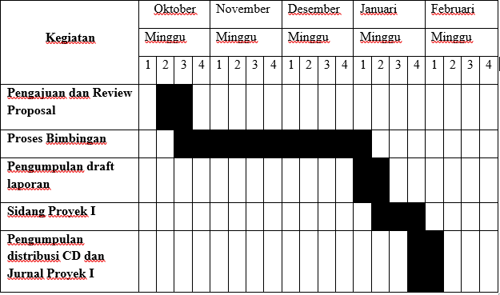

<h3 align="center"> BAB I   
PENDAHULUAN </h3>
 
<b>1.1	Latar Belakang </b>

 Politeknik Pos Indonesia adalah salah satu perguruan tinggi yang berlokasi di Bandung dengan akreditasi BAN-PT. Politeknik Pos Indonesia mempunyai dua program studi. 
  
Pada program studi D4 Teknik Informatika setiap tahunnya melaksanakan pembuatan karya ilmiah untuk melatih kreatifitas mahasiswa yang akan menunjang kemampuan mahasiswa dalam perkembangan teknologi informasi. 
Pada program studi D4 Teknik Informatika untuk pengajuan karya ilmiah masih dilakukan secara manual, yang dimana mahasiswa melakukan pengajuan karya ilmiah berbentuk <i></i>hard copy</i> proposal, sehingga mahasiswa harus mengumpulkan <i>hard copy</i> proposal tersebut kepada koordinator. mahasiswa yang tidak berada di lingkungan kampus Politeknik Pos Indonesia pun harus tetap menemui koordinator untuk mengumpul proposal karya ilmiah sehingga terjadi ketidakefesienan dalam waktu. 
  Dengan adanya masalah tersebut, maka dibutuhkan suatu sistem komputerisasi untuk pengelolaan data pengajuan proposal karya ilmiah secara sistem  sehingga memudahkan dalam pengelolaan data proposal karya ilmiah yang diajukan oleh mahasiswa. Dalam hal ini, berusaha merancang sebuah sistem dimana sistem ini akan memberikan kemudahan bagi mahasiswa, koordinator maupun dosen agar lebih mudah dalam pengelolaan data pengajuan proposal karya ilmiah. Dalam sistem ini memudahkan mahasiswa untuk pengiriman pengajuan proposal karya ilmiah yang dapat dikirim dalam bentuk <i>softcopy </i>, selain itu mahasiswa dapat mengetahui bahwa proposal karya ilmiah yang diajukan diterima ataupun ditolak oleh koordinator, mahasiswa juga dapat melihat secara otomatis pembimbing karya ilmiah ketika karya ilmiah tersebut diterima. Sistem ini juga menyediakan layanan bagi mahasiswa untuk mendownload buku pedoman, lampiran karya ilmiah dan form absensi yang sudah disediakan secara otomatis untuk setiap mahasiswa. Koordinator dapat melihat semua proposal karya ilmiah yang diajukan oleh mahasiswa, dan dari data tersebut koordinator akan melakukan validasi proposal karya ilmiah yang diajukan. Jika proposal karya ilmiah tersebut memenuhi ketentuan yang telah ditetapkan maka koordinator akan melakukan penerimaan proposal karya ilmiah, dan secara otomatis mahasiswa dapat melihat pengumuman hasil proposal karya ilmiah yang diterima maupun ditolak berada pada sistem ini.
  Koordinator akan melakukan pendistribusian proposal karya ilmiah kepada dosen yang diajukan oleh mahasiswa. Sehingga dosen dapat mengetahui siapa saja mahasiswa yang akan dibimbing oleh dosen tersebut. Adapun proyek ini diberi judul “Sistem Perancangan Pengelolaan Proposal Karya Ilmiah Mahasiswa Program Studi D4 Teknik Informatika Menggunakan Framework CodeIgniter”. Codeigniter adalah sebuah framework php yang memudahkan developernya untuk membuat aplikasi web dengan cepat dibandingkan dengan membuatnya dari awal , selain itu codeigniter memakai konsep MVC <i> (Model View Controller)</i> dimana pengerjaan logika dan layout telah dipisahkan sehingga memudahkan programmer dan designer dalam melakukan tugasnya.

 
<b>1.2	Identifikasi Masalah </b>

Berdasarkan latar belakang yang telah dikemukakan di atas, masalah dapat  diidentifikasi sebagai berikut : 
1.	Belum adanya sistem informasi pengajuan proposal karya ilmiah program studi D4 Teknik Informatika. 
2.	Perlu adanya pelayanan berbasis teknologi informasi agar memudahkan mahasiswa dan koordinator. 
3.	Dalam proses pengajuan proposal karya ilmiah masih menggunakan cara manual sehingga kurang efisien.

 
 <b>1.3	Tujuan</b>

Tujuan dari pembuatan Sistem Perancangan Pengelolaan Proposal Karya Ilmiah Mahasiswa Program Studi D4 Teknik Informatika Menggunakan Framework CodeIgniter, yaitu : 
1.	Membuat sistem informasi pengajuan proposal karya ilmiah. 
2.	Dengan adanya sistem ini, koordinator dapat menyampaikan atau mendistrubusikan informasi kepada dosen maupun mahasiswa.   
3.	Untuk memudahkan dalam pengajuan proposal karya ilmiah sehingga waktu dan data yang dihasilkan akan lebih efisien dibandingkan proses manual. 
4.	Dengan adanya sistem ini, Informasi-informasi yang berkaitan dengan kegiatan karya ilmiah dapat dilihat dan di upload oleh mahasiswa ataupun dosen

 <b>1.4  Ruang Lingkup</b>

Di dalam proposal ini membahas sistem informasi pengajuan proposal karya ilmiah, Materi bahasan dalam proposal ini meliputi bahasa pemograman php, dan adapun batasan masalah materi uraian dalam sebuah proposal, yang dimaksudkan untuk men-spesifikasi materi-materi utama yang harus di bahas dalam proposal ini, adalah sebagai berikut: 
1.	Sistem ini meliputi proses penginputan data proposal karya ilmiah   yang diajukan oleh mahasiswa D4 Teknik Informatika. 
2.	Sistem ini hanya berlaku hingga proses validasi proposal karya ilmiah yang diajukan oleh mahasiswa. 
3.	Data pengajuan proposal karya ilmiah oleh mahasiswa akan dikelola dan di review oleh koordinator.

 <b>1.5 Jadwal Kegiatan Pengerjaan Proyek</b>

Gambar 1.1 Jadwal Kegiatan
